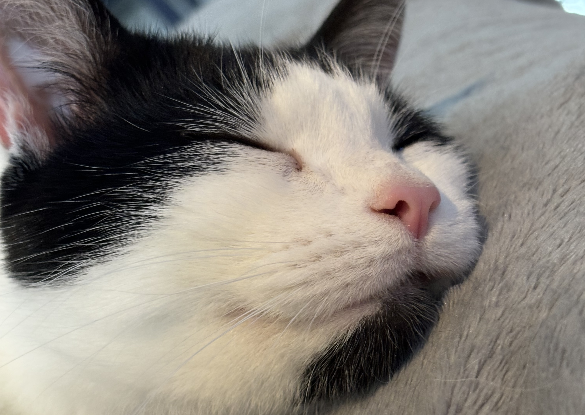

## Hello there 👋

I'm a senior backend engineer currently working in eCommerce for a big brand. I love fostering and improving team culture, I've talked about it on [podcasts](https://open.spotify.com/episode/3qxG0JObxswxfz8l9YbIZr?si=c0a9b48cefcb4773) and at [meetups](https://meetup.thefusionhub.co.uk/events/meetup-2024-02-29). I've also written posts on [technical](https://davidmn.org/posts/tech/ghost-to-hugo/) [topics](https://medium.com/asos-techblog/replacing-postman-with-rider-1aae3a25fa34) [too](https://davidmn.org/posts/tech/arm-to-bicep/).

I build distributed event driven systems, mostly in C#, hosted in Kubernetes, backed by document databases communicating via message queues and topics. I'm not only a backend engineer, I've built the odd frontend in React. I like to work in an XP way with lots of pair programming, development guided by tests, and fast feedback cycles.

I love to build really simple static sites that do one specific thing, for example an easy way for a podcast I enjoy to [share their playlists](https://enjoyaplayli.st), or a simple [scoreboard for playing crokinole](https://davidmn.github.io/crokinole-scoring/).

Outside of tech I love table top gaming, being a butler to our cat Enzo, and listening to/playing [niche guitar-centric music](https://open.spotify.com/playlist/4rhyXjREPTKLH7BT1Mr3l3?si=e468a5960f934cc5). 

